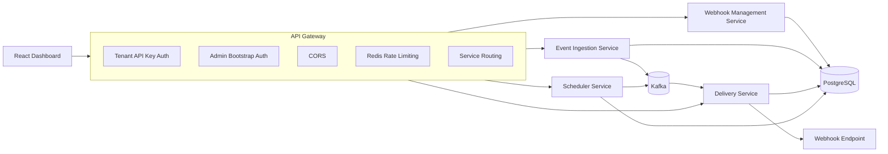

# Webhook Delivery Platform

[](https://github.com/ErenKarakus1/Webhook-Delivery-Platform/actions/workflows/ci.yml)


A microservices-based webhook delivery platform built with Java, Spring Boot, PostgreSQL, Redis, Kafka, Docker, and React. The project demonstrates practical backend infrastructure patterns: tenant API keys, endpoint and subscription management, idempotent event ingestion, Kafka-based asynchronous delivery, HMAC webhook signatures, retry scheduling, dead-letter replay, rate limiting, and a Docker Compose demo environment.

## Demo Video

[](https://youtu.be/dX0FkTvRl-M)

▶ **Click the image above to play the demo video**

## Features

- Tenant and API key bootstrap flow
- HTTPS webhook endpoint management
- Event subscription management
- Idempotent event ingestion
- Kafka-based delivery job publishing
- HMAC-SHA256 webhook request signing
- Delivery attempt history
- Retry queue with manual retry and cancel actions
- Dead-letter queue with clear and replay actions
- Redis-backed gateway rate limiting
- Flyway-managed PostgreSQL schema
- React dashboard for local demos
- Backend and frontend test/build checks

## Architecture



The dashboard talks to the API gateway. The gateway authenticates requests, applies rate limiting, and routes tenant APIs to the correct Spring service. Events are stored by the ingestion service and published to Kafka as delivery jobs. The delivery service consumes jobs, signs outbound webhook requests, records attempts, and schedules retries. The scheduler republishes due retries. Exhausted deliveries are stored in the dead-letter queue and can be replayed from the dashboard.

## Demo Walkthrough

Start the full local stack:

```bash
docker compose up -d --build
```

The Compose demo starts PostgreSQL, Flyway, Redis, Kafka, all Spring services, and the React dashboard.

Open:

```text
Dashboard: http://localhost:3000
API gateway: http://localhost:8080
```

Check the gateway health endpoint:

```bash
curl http://localhost:8080/actuator/health
```

Create a tenant from the dashboard, or load repeatable demo data:

```bash
docker compose --profile seed up seed-demo
```

Demo dashboard credentials:

```text
Tenant ID: 11111111-1111-1111-1111-111111111111
API key: demo-api-key
```

Then:

```text
1. Add a reachable HTTPS webhook endpoint.
2. Add a subscription for an event type such as order.created.
3. Send a test event.
4. Select the event to inspect its payload and delivery attempts.
5. Open the retry and dead-letter queues to retry, cancel, clear, or replay failed deliveries.
```

Run the smoke test:

```bash
node scripts/smoke-test.mjs
```

Use a custom webhook URL for the smoke test:

```bash
WEBHOOK_URL="https://example.com/webhooks" node scripts/smoke-test.mjs
```

PowerShell:

```powershell
$env:WEBHOOK_URL = "https://example.com/webhooks"
node scripts/smoke-test.mjs
```

Stop the demo:

```bash
docker compose down
```

## Configuration

Local defaults live in `docker-compose.yml`. Copy `.env.example` when you want to override ports, credentials, admin API key, or rate limits:

```bash
cp .env.example .env
```

PowerShell:

```powershell
Copy-Item .env.example .env
```

Common values:

```text
API_GATEWAY_PORT=8080
DASHBOARD_PORT=3000
POSTGRES_PORT=5432
REDIS_PORT=6379
KAFKA_PORT=9092
ADMIN_API_KEY=local-admin-key
GATEWAY_RATE_LIMIT_REQUESTS_PER_MINUTE=120
```

## Webhook Signing

Each delivery request includes signature headers generated with the endpoint secret:

```text
X-Webhook-Event-Id
X-Webhook-Event-Type
X-Webhook-Timestamp
X-Webhook-Signature
```

The signature is an HMAC-SHA256 digest of:

```text
timestamp + "." + rawBody
```

The dashboard shows each endpoint secret and a Node.js verification example.

## Endpoints

- `POST /tenants`: create tenant with admin API key
- `POST /tenants/{tenantId}/api-keys`: create tenant API key
- `GET /tenants/{tenantId}/endpoints`: list webhook endpoints
- `POST /tenants/{tenantId}/endpoints`: create webhook endpoint
- `GET /tenants/{tenantId}/subscriptions`: list subscriptions
- `POST /tenants/{tenantId}/subscriptions`: create subscription
- `POST /tenants/{tenantId}/events`: ingest event
- `GET /tenants/{tenantId}/attempts`: list delivery attempts
- `GET /tenants/{tenantId}/retries`: list retry queue
- `POST /tenants/{tenantId}/retries/{retryId}/dispatch`: retry now
- `GET /tenants/{tenantId}/dead-lettered-events`: list dead letters
- `POST /tenants/{tenantId}/dead-lettered-events/{deadLetterId}/replay`: replay dead letter

## Known Limitations

- Authentication is API-key based for the MVP. A production system would typically add user accounts, OAuth/OIDC, scoped tokens, and key rotation.
- Webhook endpoint validation is intentionally strict and rejects hosts that cannot be resolved.
- Retry policy is fixed in service configuration rather than editable per endpoint.
- Kafka topics are auto-created in the local demo.
- The dashboard is a local portfolio/demo UI rather than a multi-user admin product.
- Docker Compose is intended for local demonstration, not hardened production deployment.

## Future Improvements

- Add user login and role-based tenant access.
- Add endpoint secret rotation.
- Add per-endpoint retry policy configuration.
- Add OpenTelemetry tracing across services.
- Add Prometheus metrics dashboards.
- Add pagination for large tenants.
- Add Kubernetes or Helm deployment examples.

## Development

Run backend tests:

```bash
cd backend/services
mvn test
```

Run frontend checks:

```bash
cd frontend/dashboard
npm install
npm run build
```

Run the dashboard dev server:

```bash
cd frontend/dashboard
npm run dev
```

Validate Docker Compose:

```bash
docker compose config
```

## License

MIT License

Copyright (c) 2026 Eren Karakuş
